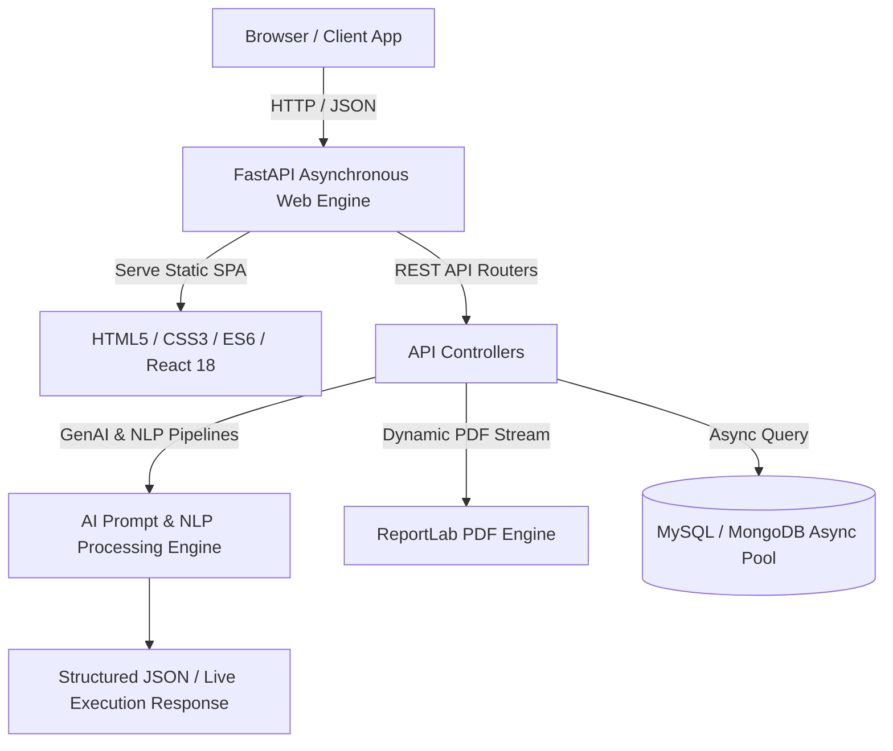

# 🚀 Aman Varma — Full-Stack Python Backend & GenAI Portfolio

<div align="center">


### **Aman Varma**
**Python & AI Backend Engineer | Python Developer Intern @ Druidot Consulting**
*B.Tech in Computer Science & Engineering (AKTU, CGPA: 7.12)*

[🌐 Live Portfolio Site](http://127.0.0.1:8000) • [📄 Download Resume](http://127.0.0.1:8000/api/download-resume) • [💼 LinkedIn Profile](https://www.linkedin.com/in/aman-v-697771345) • [✉️ Email Aman](mailto:amangurauli@gmail.com)

---

[](https://python.org)
[](https://fastapi.tiangolo.com)
[](https://flask.palletsprojects.com)
[](https://react.dev)
[](#ai-studio)
[](#tech-stack)
[](https://render.com)

</div>

---

## 📌 Executive Summary

Welcome to the official full-stack repository for **Aman Varma's Developer Portfolio**. This application is built as a high-performance **FastAPI microservice application** integrated with **React 18 interactive engines**, an **AI Prompt Studio**, a live **REST API Sandbox**, interactive **PDF Resume Generation**, and complete showcases of **6 Production Projects** and **Industry Certifications**.

---

## ✨ Key Features & System Capabilities

- **⚡ Full-Stack FastAPI Architecture**: High-speed asynchronous Python backend serving dynamic static frontend assets and REST API endpoints.
- **⚛️ React 18 Dynamic Engines**: Interactive stateful UI widgets embedded for the **AI Studio** & **REST API Sandbox**.
- **🧠 AI Studio (GenAI Pipeline)**: Live prompt execution environment supporting Summarization, Code Generation, Sentiment Analysis, and Entity Extraction.
- **💻 REST API Sandbox**: In-browser API client enabling instant live execution and payload inspection against system endpoints.
- **📄 Instant PDF Resume Generation**: Automated programmatic resume generator built using ReportLab with direct web viewer modal and download support (`/api/download-resume`).
- **🌐 6 Production Live Projects**: Highlighting NLP CRM engines, ContentDesk AI, TrainIQ Logistics, Data Warehouse ETL pipelines, and Voice Sentiment models with live web links.
- **🏆 Verified Industry Certifications**: Real high-resolution credentials from Infosys Springboard, TATA GenAI, JPMorgan Chase Quant, and Udemy Cyber Security.
- **🎨 Modern Dark Cyberpunk Aesthetic**: Built with glassmorphism, responsive CSS grid/flexbox layouts, custom glowing ambient orbs, and interactive micro-animations.

---

## 🛠️ Architecture & Tech Stack



### **Core Stack**
- **Backend & APIs**: Python 3.13, FastAPI, Flask, Uvicorn, Pydantic v2, ReportLab, AsyncIO
- **AI & NLP**: Generative AI Prompt Engineering, NLP (TF-IDF, Intent Classification, Keyword Extraction), Hugging Face Transformers
- **Frontend & UI**: HTML5, Vanilla CSS3 (Dark Theme, Glassmorphism, CSS Grid/Flexbox), React 18, FontAwesome 6, Google Fonts
- **Database & DevOps**: MySQL, MongoDB, Docker, Git/GitHub Actions, Render Cloud Deployment

---

## 📂 Repository Structure

```text
AMAN-VARMA-PORTFOLIO/
├── backend/
│   ├── __init__.py
│   ├── ai_engine.py             # GenAI prompt execution & NLP pipeline engine
│   └── resume_generator.py      # Automated PDF Resume builder (ReportLab)
├── frontend/
│   ├── assets/                  # Dynamic PDF resume & static downloads
│   ├── css/
│   │   └── styles.css           # Modern Cyberpunk Dark Theme & Responsive Layouts
│   ├── images/
│   │   ├── profile_professional.jpg # High-resolution portrait headshot
│   │   ├── logo.jpg             # Brand logo badge
│   │   └── certificates/        # High-res industry certification images
│   ├── js/
│   │   ├── main.js              # Interactivity, smooth scroll, PDF modal, API fetchers
│   │   └── react_app.js         # React 18 components (AI Studio & API Sandbox)
│   └── index.html               # Main Single Page Application UI
├── generate_resume_pdf.py       # Standalone script to compile PDF Resume
├── main.py                      # Main FastAPI server entry point & REST API routes
├── run_server.py                # Server runner script
├── requirements.txt             # Python dependencies
├── render.yaml                  # Render deployment configuration
└── README.md                    # System documentation
```

---

## 🚀 Live Projects Showcase

| Project Name | Description | Key Tech Stack | Live Demo | Repository |
| :--- | :--- | :--- | :---: | :---: |
| **NLPCRM Engine** | Automated customer support ticket classification & intent extraction | FastAPI, Python NLP, TF-IDF, Scikit-Learn | [Live Demo](https://nlp-crm-fastapi.onrender.com) | [GitHub](https://github.com/Amanvarma2231/NLP-CRM-FASTAPI) |
| **ContentDesk AI** | AI-powered multi-channel content generation workflow suite | Flask, GenAI Prompt Engine, OpenAI API | [Live Demo](https://contentdesk-ai.onrender.com) | [GitHub](https://github.com/Amanvarma2231/ContentDesk-AI) |
| **TrainIQ Engine** | Asynchronous railway booking & real-time logistics tracker | FastAPI, MySQL, AsyncIO, Python | [Live Demo](https://train-iq.onrender.com) | [GitHub](https://github.com/Amanvarma2231/TrainIQ-FastAPI) |
| **Enterprise Data Warehouse** | Containerized ETL pipeline & automated data analytics warehouse | Python, MySQL, Docker, Pandas | [Live Demo](https://edw-analytics.onrender.com) | [GitHub](https://github.com/Amanvarma2231/Enterprise-Data-Warehouse) |
| **SkillDev Platform** | Interactive learning analytics hub & skill tracking system | Flask, MongoDB, Chart.js, HTML/CSS | [Live Demo](https://skilldev-portal.onrender.com) | [GitHub](https://github.com/Amanvarma2231/SkillDev-Platform) |
| **Voice Sentiment AI** | Speech-to-intent sentiment scoring & audio emotion pipeline | Python NLP, Librosa, WaveNet | [Live Demo](https://voice-sentiment-ai.onrender.com) | [GitHub](https://github.com/Amanvarma2231/Voice-Sentiment-AI) |

---

## 🔌 REST API Reference

The server exposes interactive REST API endpoints accessible directly or via the built-in **API Sandbox**:

| Endpoint | Method | Description | Sample Request Body / Query |
| :--- | :---: | :--- | :--- |
| `/api/health` | `GET` | System health check & uptime status | `N/A` |
| `/api/ai-studio` | `POST` | Execute AI prompt workflows (Summarize, Code, Sentiment) | `{"task": "summarize", "prompt": "..."}` |
| `/api/sandbox` | `POST` | Execute interactive API query testing | `{"endpoint": "/api/health", "payload": {}}` |
| `/api/download-resume` | `GET` | Dynamic stream or download of Aman Varma's PDF Resume | `N/A` |
| `/api/projects` | `GET` | Retrieve structured JSON of all 6 live production projects | `N/A` |

---

## ⚙️ Local Installation & Setup

Follow these simple steps to run the portfolio server locally on your machine:

### **1. Clone the Repository**
```bash
git clone https://github.com/Amanvarma2231/AMAN-VARMA-PORTFOLIO.git
cd AMAN-VARMA-PORTFOLIO
```

### **2. Create & Activate Virtual Environment**
```bash
# Windows
python -m venv venv
venv\Scripts\activate

# macOS / Linux
python3 -m venv venv
source venv/bin/activate
```

### **3. Install Dependencies**
```bash
pip install -r requirements.txt
```

### **4. Generate PDF Resume (Optional)**
```bash
python generate_resume_pdf.py
```

### **5. Run FastAPI Server**
```bash
python run_server.py
```

The application will be running live at: **`http://127.0.0.1:8000`**

---

## ☁️ Deployment on Render

This project is configured for one-click deployment on **Render**:

1. Log into [Render Dashboard](https://dashboard.render.com).
2. Click **New +** -> **Web Service**.
3. Select repository **`Amanvarma2231/AMAN-VARMA-PORTFOLIO`**.
4. Configure service settings:
   - **Runtime**: `Python 3`
   - **Build Command**: `pip install -r requirements.txt`
   - **Start Command**: `uvicorn main:app --host 0.0.0.0 --port $PORT`
5. Click **Create Web Service**.

---

## 👨‍💻 About Aman Varma

- 🎓 **Education**: B.Tech in Computer Science & Engineering (AKTU) | CGPA: 7.12
- 💼 **Current Role**: Python Developer Intern @ Druidot Consulting (7+ Months)
- 📍 **Location**: Ghaziabad, Uttar Pradesh, India
- 📧 **Email**: [amangurauli@gmail.com](mailto:amangurauli@gmail.com)
- 🌐 **GitHub**: [github.com/Amanvarma2231](https://github.com/Amanvarma2231)
- 🔗 **LinkedIn**: [linkedin.com/in/aman-v-697771345](https://www.linkedin.com/in/aman-v-697771345)

---

<div align="center">

Designed & Developed with ❤️ by **Aman Varma** © 2026. All Rights Reserved.

</div>
